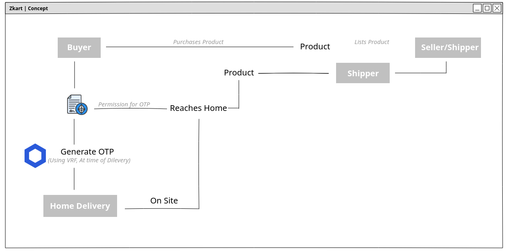
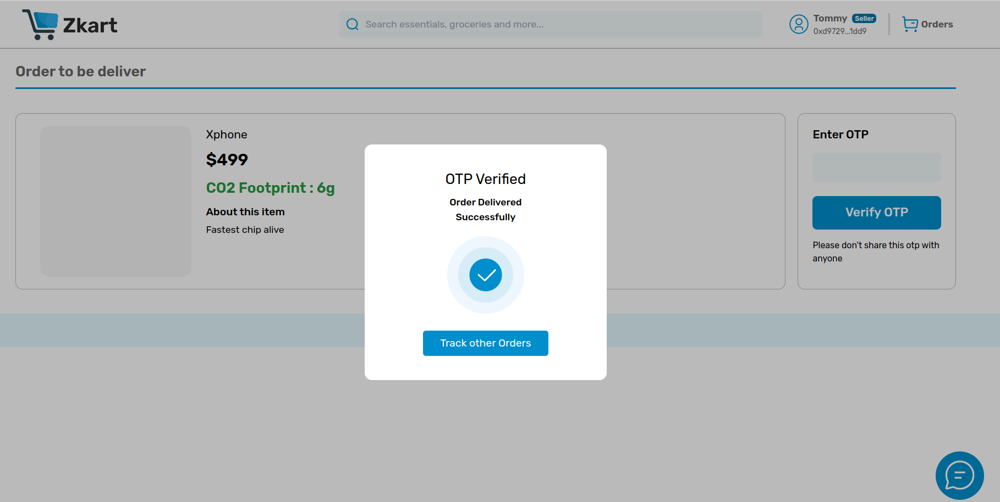
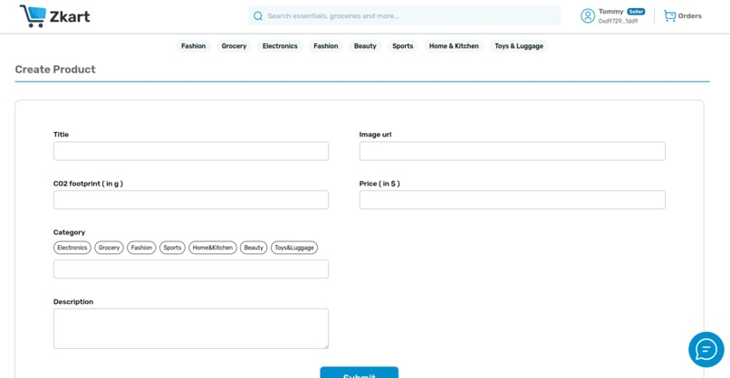

# Zkart 

I aimed to develop scalable shipping methods alongside local decentralized marketplaces, a concept less prevalent nowadays. The project offers a framework accessible to anyone, anywhere, with additional compliance checks for local laws. Instead of creating yet another trust-based OTP verification system, I designed a universal one that seamlessly integrates into any application.

